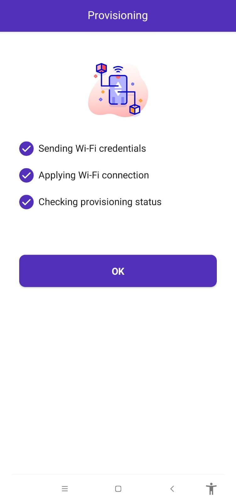
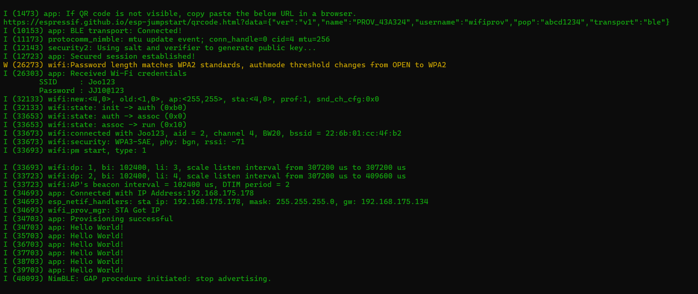

# ESP32 Wi-Fi Provisioning over BLE

This project demonstrates Wi-Fi provisioning for an ESP32 device using Bluetooth Low Energy (BLE). The ESP32 connects to a mobile app (either the default Espressif app or a custom one) over BLE to enable easy and secure configuration of Wi-Fi credentials. 

## Table of Contents

- [Introduction](#introduction)
- [Features](#features)
- [Getting Started](#getting-started)
  - [Prerequisites](#prerequisites)
  - [Setting Up Your Development Environment](#setting-up-your-development-environment)
  - [Flashing the Code to ESP32](#flashing-the-code-to-esp32)
  - [Wi-Fi Provisioning](#wi-fi-provisioning)


- [Screenshots](#screenshots)
- [Video Demo](#video-demo)


## Introduction

This project uses the Espressif ESP32 Wi-Fi provisioning library, which allows you to provision Wi-Fi credentials to an ESP32 device via BLE. The ESP32 will act as a BLE server, and the mobile app acts as a BLE client, sending the Wi-Fi credentials to the ESP32. This method provides an easy, secure way to set up devices without hardcoding Wi-Fi credentials.

## Features

- BLE communication between the ESP32 and a mobile app.
- Wi-Fi provisioning via a secure BLE connection.
- Example code provided with the ESP-IDF framework for the ESP32.
- Customizable and scalable for different use cases.

## Getting Started

Follow these steps to get the project up and running.

### Prerequisites

To use this project, you'll need the following:

- **ESP32 Development Board**
- **ESP-IDF** (Espressif IoT Development Framework)
  - Version: 5.x.x or higher
- **Python** (for ESP-IDF)
- **A mobile device** with the Espressif Wi-Fi Provisioning app or your custom BLE app installed

### Setting Up Your Development Environment

1. Install the **ESP-IDF** framework by following the instructions on the official [Espressif website](https://docs.espressif.com/projects/esp-idf/en/latest/esp32/get-started/).
   
2. Install required dependencies using the following command in the terminal:

   ```bash
   python -m pip install -r $IDF_PATH/requirements.txt
3.Set up the ESP32 toolchain and environment variables:

    
    source $IDF_PATH/export.sh
   
On Windows, you may need to use export.bat instead.

## Flashing the Code to ESP32
Open the project folder in your terminal and navigate to the folder where the code is located.

Run the following command to build and flash the code to the ESP32:


    idf.py build
    idf.py -p PORT flash monitor
Once the code is flashed, the ESP32 will start the BLE provisioning process.It will display a qr code.

## Wi-Fi Provisioning
Open the Espressif Wi-Fi Provisioning app on your mobile device.
Ensure that your mobile device's Bluetooth and location services are turned on.
In the app, scan the qr code to connect.
Once connected, you will be prompted to enter your Wi-Fi network credentials.
After entering the Wi-Fi credentials, the ESP32 will connect to the network and print the connection status in the serial monitor.


After flashing the ESP32 and connecting to the BLE service with the mobile app, the ESP32 will automatically attempt to connect to the provided Wi-Fi network. Once connected, the ESP32 will print the connection status to the serial monitor.

Example Serial Monitor Output:

    I (2000) wifi: Connecting to Wi-Fi...
    I (5000) wifi: Connected to Wi-Fi: my_network
    I (5000) wifi: IP Address: 192.168.1.100
## Screenshots



## Video output
Watch the demo of the project in action:

[Watch the ESP32 Wi-Fi Provisioning Demo](video/espproject(1).mp4)

